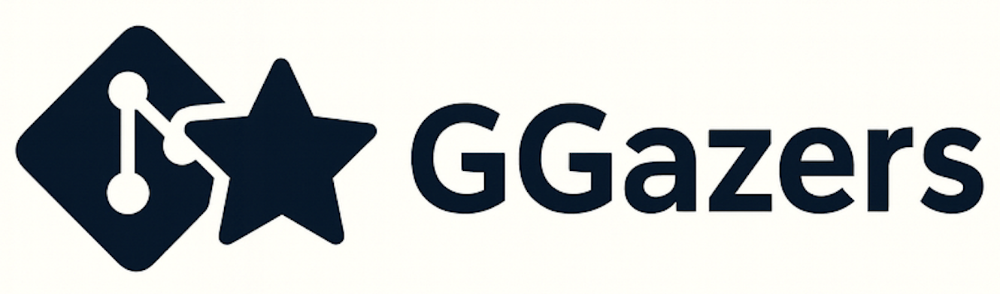
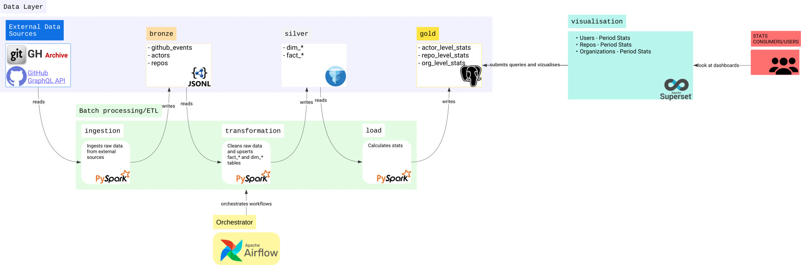
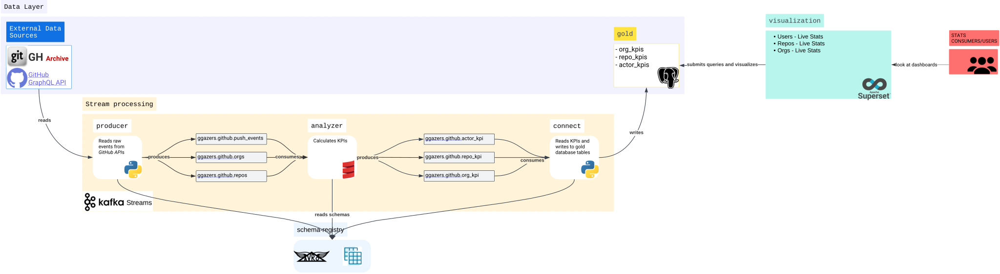

<a name="readme-top"></a>
<br />
<div align="center">
    

  <h3 align="center">ggazers</h3>
</div>

<!-- TABLE OF CONTENTS -->
<details>
  <summary>Table of Contents</summary>
  <ol>
    <li>
      <a href="#about-the-project">About The Project</a>
      <ul>
        <li><a href="#built-with">Built With</a></li>
        <li>
          <a href="#solution-architecture">Solution Architecture</a>
          <ul>
            <li><a href="#batch-processing-layer">Batch Processing Layer</a></li>
            <li><a href="#stream-processing-layer">Stream Processing Layer</a></li>
          </ul>
        </li>
      </ul>
    </li>
    <li>
      <a href="#getting-started">Getting Started</a>
      <ul>
        <li><a href="#prerequisites">Prerequisites</a></li>
        <li><a href="#local-setup">Local setup</a></li>
      </ul>
    </li>
  </ol>
</details>


# About The Project

`ggazers` is a data platform that ingests raw GitHub activity data, transforms it, calculates statistics, and provides analytics.

The platform follows the Lambda Architecture pattern and consists of the following layers:
1. Batch processing layer
2. Stream processing layer
3. Batch data layer
4. Stream data layer
5. Orchestration layer
6. Visualization layer

## Built With
* [![Python][Python]][Python-url]
* [![Scala][Scala]][Scala-url]
* [![Apache Spark][Spark]][Spark-url]
* [![PostgreSQL][Postgres]][Postgres-url]
* [![Apache Kafka][Kafka]][Kafka-url]
* [![Kafka Streams][KafkaStreams]][KafkaStreams-url]
* <a href="https://iceberg.apache.org/"></a>
* <a href="https://superset.apache.org/"></a>


## Solution Architecture

*Diagram-1* and *Diagram-2* illustrate the overall system architecture of the platform, including the batch and stream processing pipelines.

### Batch Processing Layer
[](docs/ggazer_batch_solution_a.svg)
<p align="center"> <i>Diagram-1</i></p>


### Stream Processing Layer
[](docs/ggazer_streams_solution_a.svg)
<p align="center"> <i>Diagram-2</i></p>

<p align="right">(<a href="#readme-top">back to top</a>)</p>

# Getting Started

## Prerequisites
- <a href="https://www.docker.com/"> Docker </a>
- <a href="https://docs.docker.com/compose/"> Docker Compose </a>
- <a href="https://www.gnu.org/software/make/"> GNU Make </a>

## Local Setup
To bring up the stream-processing, batch-processing, orchestration, and visualization infrastructure, run:

```bash
make up
```

<p align="right">(<a href="#readme-top">back to top</a>)</p>


<!-- MARKDOWN LINKS & IMAGES -->
[Python]: https://img.shields.io/badge/Python-3776AB?style=for-the-badge&logo=python&logoColor=white
[Python-url]: https://www.python.org/

[Scala]: https://img.shields.io/badge/Scala-DC322F?style=for-the-badge&logo=scala&logoColor=white
[Scala-url]: https://www.scala-lang.org/

[Spark]: https://img.shields.io/badge/Apache_Spark-E25A1C?style=for-the-badge&logo=apachespark&logoColor=white
[Spark-url]: https://spark.apache.org/

[Postgres]: https://img.shields.io/badge/PostgreSQL-316192?style=for-the-badge&logo=postgresql&logoColor=white
[Postgres-url]: https://www.postgresql.org/

[Kafka]: https://img.shields.io/badge/Apache_Kafka-231F20?style=for-the-badge&logo=apachekafka&logoColor=white
[Kafka-url]: https://kafka.apache.org/

[KafkaStreams]: https://img.shields.io/badge/Kafka_Streams-231F20?style=for-the-badge&logo=apachekafka&logoColor=white
[KafkaStreams-url]: https://kafka.apache.org/documentation/streams/
